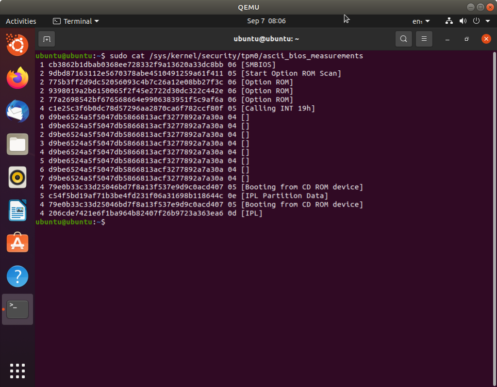

# Investigate TPM measurement under Qemu with OVMF+swtpm.

TPM measure boot is a way to protect boot cycle against external tampering. A measured boot process relies on TPM chip and, for all boot stages, saves an hash that can't be overwrite until next boot cycle. That gives a way to check hash values to guarantee boot operations were not altered.

## SWTPM

swtpm is a TPM emulator that can simulate a TPM device on a QEMU instance. Project [link](https://github.com/stefanberger/swtpm) on github. This must be installed on host machine that would be later used to run a QEMU instance. To install from sources can follow related instruction into INSTALL file included in repository. After "make install" step is done and swtpm executable is available on host system, start swtpm as described into this [page](https://en.opensuse.org/Software_TPM_Emulator_For_QEMU) where path_to_vm is any folder under the VM directory:

    $ mkdir ${path_to_vm}/mytpm0
    
    $ swtpm socket --tpmstate dir=${path_to_vm}/mytpm0 --ctrl type=unixio,path=${path_to_vm}/mytpm0/swtpm-sock --log level=20

## QEMU

Given an image is available for QEMU (in the following Ubuntu desktop 20.04 have been used for this test of swtpm).
1. Create an hard drive image for the system, using qcow format would dinamically increase size on request up to desired quota (20 GB in the example):

        $ qemu-img create -f qcow2 ubuntu.qcow 20G

2. Start QEMU instance with special parameters to create the emulated TPM device:

        $ sudo qemu-system-x86_64 -m 2048 -enable-kvm -cpu host -cdrom ubuntu-20.04.3-desktop-amd64.iso -drive file=ubuntu.qcow -chardev socket,id=chrtpm,path=${path_to_vm}/mytpm0/swtpm-sock -tpmdev emulator,id=tpm0,chardev=chrtpm -device tpm-tis,tpmdev=tpm0

If everything is successful, on guest system it is now possible to open a terminal and read content of TPM device registers into /sys/kernel/security/tpm0 either in binary (binary_bios_measurements) or ascii format (ascii_bios_measurements)

## TPM PCR index's

To help decode measure boot content, please refer to following table:

<table>
    <tr><th>PCR Index</th><th>PCR Usage</th></tr>
    <tr><td>0</td><td>CRTM, BIOS and platfrom extensions</td></tr>
    <tr><td>1</td><td>Host Platform Configuration</td></tr>
    <tr><td>2</td><td>Option ROM Code</td></tr>
    <tr><td>3</td><td>Option ROM Configuration and Data</td></tr>
    <tr><td>4</td><td>IPL Code (usually the MBR)</td></tr>
    <tr><td>5</td><td>IPL Code Configuration and Data (for use by the IPL Code)</td></tr>
    <tr><td>6</td><td>State Transitions and Wake Events</td></tr>
    <tr><td>7</td><td>Host Platform Manufacturer Control</td></tr>
    <tr><td>8-15</td><td>Defined for use by the Static Operating System. Host Platform</td></tr>
</table>